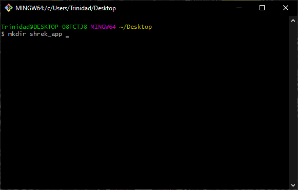
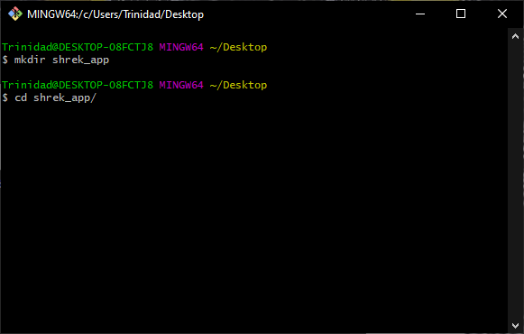

# [Inicio](https://centrodecomputoitslp.github.io/que_personaje_shrek_eres)

### 1. Crea un directorio para el proyecto
1.1 Crea un nuevo directorio el cual se usará como área de trabajo.
```
mkdir shrek_app
```


1.2 Accede al directorio creado en el paso anterior.
```
cd shrek_app
```


