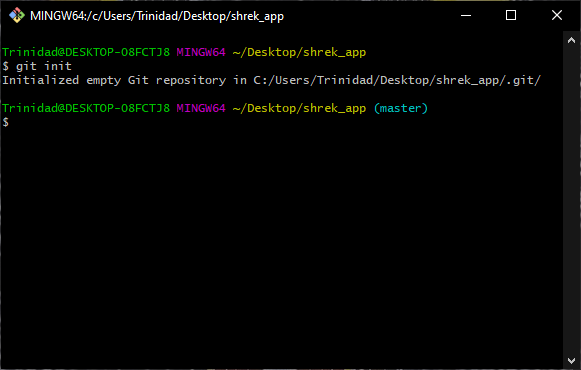
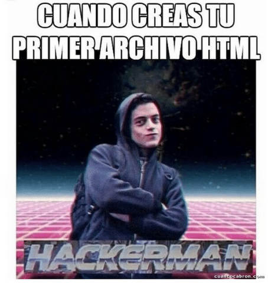
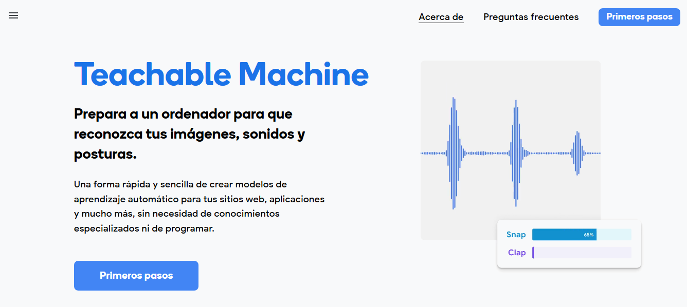
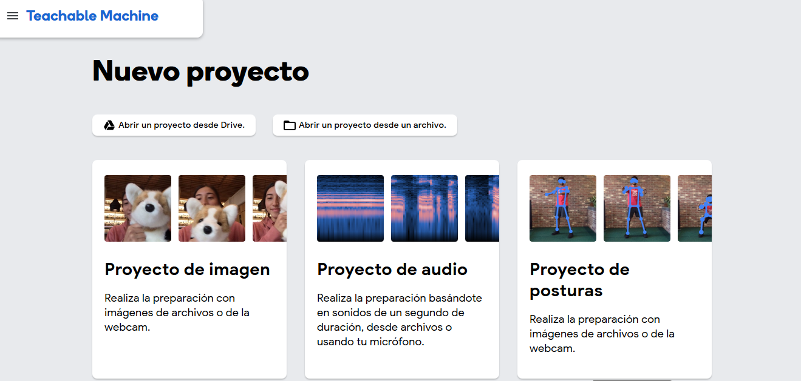
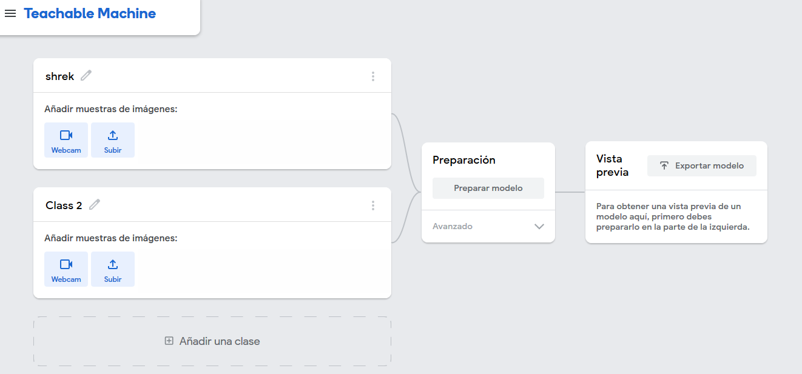
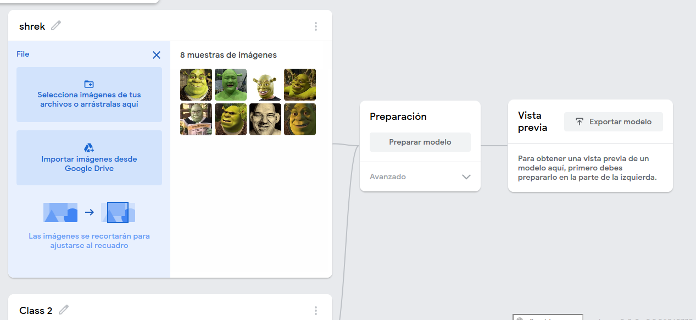
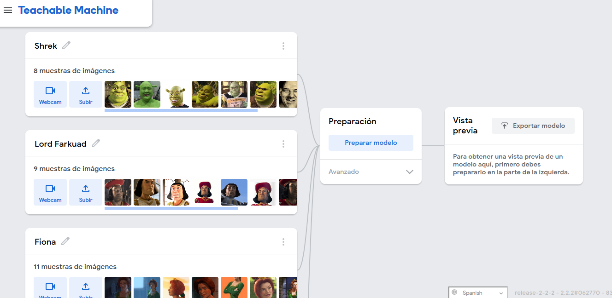
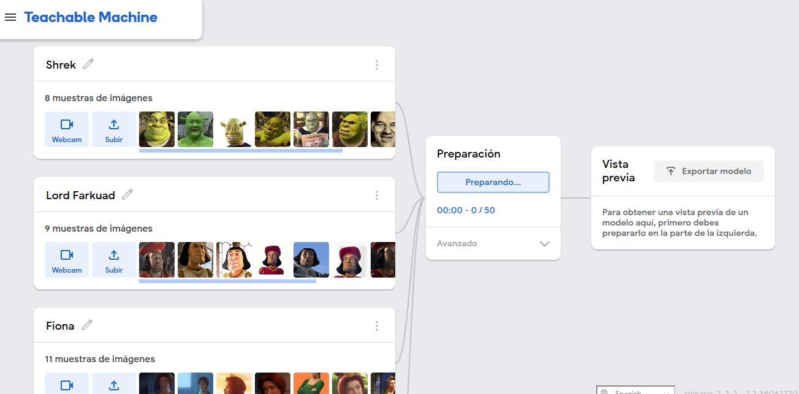
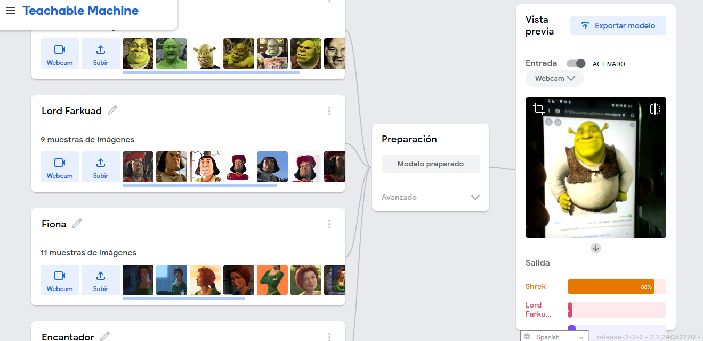
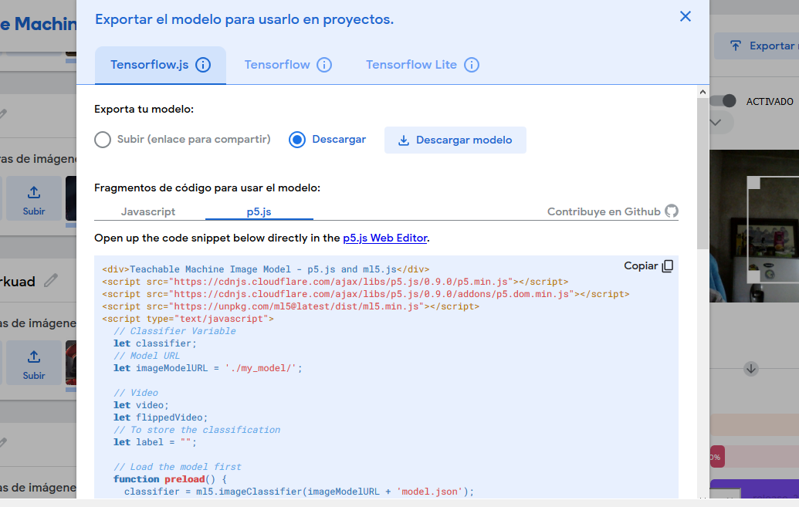

# [Inicio](https://centrodecomputoitslp.github.io/que_personaje_shrek_eres)
## Guía desde cero
### 1. Crea un directorio para el proyecto
 1.1 Crea un nuevo directorio el cual se usará como área de trabajo.
```
mkdir shrek_app
```

1.2 Accede al directorio creado en el paso anterior.
``` 
cd shrek_app 
```

### 2. Inicializar el repositorio git (opcional)
2.1 Inicializamos el repositorio para controlar las versiones usando git.
``` 
git init
```

### 3. Inicializar proyecto de Node.js
Considere que para este punto ya debería de tener configurado node.js en su maquina. De lo contrario puede revisar su instalación en el siguiente [link](https://nodejs.org/es/).

3.1 Haciendo uso de el manejador de dependencias NPM,  inicializaremos un proyecto con la siguiente instrucción:
``` 
npm init
```
3.2 Después de ejecutar la instrucción se le solicitara algunos datos: 

package name: (shrek_app) <br> 
version: (1.0.0) <br> 
description: <br> 
<b>
entry point: server.js <br> 
</b>
test command:<br>
git repository: <br>
keywords:<br>
author:<br>
license: (ISC) <br>

Cuando nos solicite el valor "entry point" escribiremos ```server.js```.
Podemos dejar los otros valores por defecto. 

Al finalizar habrá generado un archivo llamado package.json como el que se muestra enseguida.

<h4>Package.json</h4>

```
{
  "name": "shrek_app",
  "version": "1.0.0",
  "description": "",
  "main": "server.js",
  "scripts": {
    "test": "echo \"Error: no test specified\" && exit 1"
  },
  "repository": {},
  "author": "",
  "license": "ISC",
  "bugs": { }  
}
```
Enseguida te dejo una breve lectura en donde [Fernando Larrañaga](https://medium.com/@Xabadu). no explica de forma minuciosa el uso de este archivo: ["Tú, yo y package.json"](https://medium.com/noders/t%C3%BA-yo-y-package-json-9553929fb2e3).

### 4. Configurar el servidor (express)
4.1 Instalación de Express.<br>
Para instalar la liberia/dependencia existen diversas maneras a continuación se muestran dos de las mas comunes:

- opción 1:Haciendo uso del manejador de paquetes NPM
```
npm install express --save
```
- opción 2: Modificando el archivo package.js
<br>

Abriremos el archivo ```package.js``` para agregar la liberia/dependencia. 

```
"dependencies": {
    "express": "^4.17.1"
  }
```
Después tendremos que usar NPM para descargar la librería
```
npm install
```

>  Si tienes dudas acercas de como configurar express puedes consultar el siguiente [link](https://expressjs.com/es/starter/installing.html)

4.2 Configuración de express <br>
Crearemos un nuevo archivo en la raíz del proyecto el cual nombraremos ```server.js``` y agregaremos las lineas dentro del archivo creado

<h4>server.js</h4>

```

var express = require('express');

var app = express();

var server = app.listen(process.env.PORT || 3000, listen);


function listen() {
    var host = server.address().address;
    var port = server.address().port;
    console.log('Servicio iniciado en http://' + host + ':' + port);
}

app.use(express.static('public'));

```

4.3 Creación del directorio para la app<br>
Crearemos un nuevo directorio en la raíz de nuestro proyecto llamada ```public``` , la cual sera el directorio en donde tendremos nuestra pequeña app.

4.4 Comprobar funcionamiento<br>
Se deberá crear un archivo nuevo el cual nombraremos ```index.html``` dentro de la carpeta ```public```.<br>
Dentro del archivo creado escribiremos la estructura básica de un html.


Estructura basica HTML:
<h4>index.html</h4>

```
<!DOCTYPE html>
<html lang="en">

<head>
    <meta charset="UTF-8">
    <meta name="viewport" content="width=device-width, initial-scale=1.0">
    <title>Personajes de shrek</title>
</head>

<body>
    <h1>Hola mundo!</h1>
</body>

</html>
```

Usaremos la siguiente instrucción para encender el servidor web  

```
node server.js
```



### 5. Agregar librería [p5.js](https://p5js.org/)


>¡p5.js es una biblioteca de JavaScript para la programación creativa, que busca hacer que programar sea accesible e inclusivo para artistas, diseñadores, educadores, principiantes y cualquier otra persona! p5.js es gratuito y de código abierto porque creemos que el software y las herramientas para aprenderlo deben ser accesibles para todos.

5.1 Agregar el CDN o descargar la liberia <br> 
Si de opta por usar el CDN solo deberá agregarse la siguiente importación dentro de el bloque ```<head></head>```.

```
<!--P5.js-->
<script src="https://cdnjs.cloudflare.com/ajax/libs/p5.js/1.1.9/p5.min.js" integrity="sha512-WIklPM6qPCIp6d3fSSr90j+1unQHUOoWDS4sdTiR8gxUTnyZ8S2Mr8e10sKKJ/bhJgpAa/qG068RDkg6fIlNFA==" crossorigin="anonymous"></script>
<!--addons-P5.js-->
<script src="https://cdnjs.cloudflare.com/ajax/libs/p5.js/1.1.9/addons/p5.sound.min.js" integrity="sha512-wM+t5MzLiNHl2fwT5rWSXr2JMeymTtixiw2lWyVk1JK/jDM4RBSFoH4J8LjucwlDdY6Mu84Kj0gPXp7rLGaDyA==" crossorigin="anonymous"></script>

```

 de tal forma que nuestro ```index.html``` tendrá el siguiente aspecto


<h4>public/index.js</h4>

```
<!DOCTYPE html>
<html lang="en">

<head>
    <meta charset="UTF-8">
    <meta name="viewport" content="width=device-width, initial-scale=1.0">
    <title>Personajes de Shrek</title>
    <!--P5.js-->
    <script src="https://cdnjs.cloudflare.com/ajax/libs/p5.js/1.1.9/p5.min.js" integrity="sha512-WIklPM6qPCIp6d3fSSr90j+1unQHUOoWDS4sdTiR8gxUTnyZ8S2Mr8e10sKKJ/bhJgpAa/qG068RDkg6fIlNFA==" crossorigin="anonymous"></script>
    <!--addons-P5.js-->
    <script src="https://cdnjs.cloudflare.com/ajax/libs/p5.js/1.1.9/addons/p5.sound.min.js" integrity="sha512-wM+t5MzLiNHl2fwT5rWSXr2JMeymTtixiw2lWyVk1JK/jDM4RBSFoH4J8LjucwlDdY6Mu84Kj0gPXp7rLGaDyA==" crossorigin="anonymous"></script>
</head>

<body>
    <h1>Hola mundo!</h1>
</body>

</html>

```

5.2 Configurar el uso de P5.js<br>
Crearemos un nuevo archivo el cual llamaremos ```sketch.js``` dentro del directorio ```public```. este nuevo archivo tendrá la siguiente estructura:

<h4>public/sketch.js</h4>

```
function setup() {
  createCanvas(400, 400);
}

function draw() {
  if (mouseIsPressed) {
    fill(0);
  } else {
    fill(255);
  }
  ellipse(mouseX, mouseY, 80, 80);
}

```
> [Como empezar con P5.js](https://p5js.org/es/get-started/)

Si visualizamos nuestra aplicación:

*****aqui va imagen

5.3 Hacer uso de la cámara<br>
Para hacer uso de la cámara modificaremos el sketch.js:

<h4>public/sketch.js</h4>

```
let video;
function setup() {
    createCanvas(400, 400);
    //Video
    video = createCapture(VIDEO);
    video.hide();
}

function draw() {
    //Renderizado de video
    image(video, 0, 0);
}


```

### 6.Entrenar un modelo en [Teachable Machine:](https://teachablemachine.withgoogle.com/)

6.1 Ingresar al sitio de Teachable Machine: <br>[https://teachablemachine.withgoogle.com/](https://teachablemachine.withgoogle.com/)



6.2 navegaremos a "Primeros pasos", una vez dentro seleccionaremos "Proyecto como imagen"










### 7. Agregar librería [ml5:](https://ml5js.org/)
7.1 Para usar la liberia podemos descargarla o usar el CDN como lo indica en la [documentación](https://learn.ml5js.org/#/)

Si de opta por usar el CDN solo deberá agregarse la siguiente importación dentro de el bloque ```<head></head>```.

```
<!--ml5.js-->
<script src="https://unpkg.com/ml5@0.4.3/dist/ml5.min.js"></script>
```
7.2 Creación de un nuevo directorio dentro de la carpeta ```public``` el cual llamaremos ```models ```

7.3 Dentro de la carpeta ```models ``` descomprimiremos los archivos generados por el modelo


7.4 Modificar el sketch.js<br>
Se modificara el sketch.js de tal manera que quede de la siguiente manera:

<h4>/public/sketch.js</h4>

```
let video;
let classifier;
let modelURL = './model/';
let label = "Espere...";

// Se carga el modelo
function preload() {
    classifier = ml5.imageClassifier(modelURL + 'model.json');
}

function setup() {
    createCanvas(640, 520);
    
    video = createCapture(VIDEO);
    video.hide();

    //Se inicia la clasificación
    classifyVideo();
}


function classifyVideo() {
    classifier.classify(video, gotResults);
}

function draw() {
    background(0);

    //Renderizado del video
    image(video, 0, 0);

    //Dibuja la etiqueta resultante
    textSize(32);
    textAlign(CENTER, CENTER);
    fill(255);
    text(label, width / 2, height - 16);
}


// STEP 3: Get the classification!
function gotResults(error, results) {
    //Si ocurre un error
    if (error) {
        console.error(error);
        return;
    }
    
    label = results[0].label;
    console.log(results[0].label);
    classifyVideo();
}
```
### 8. ¡Usar app!


